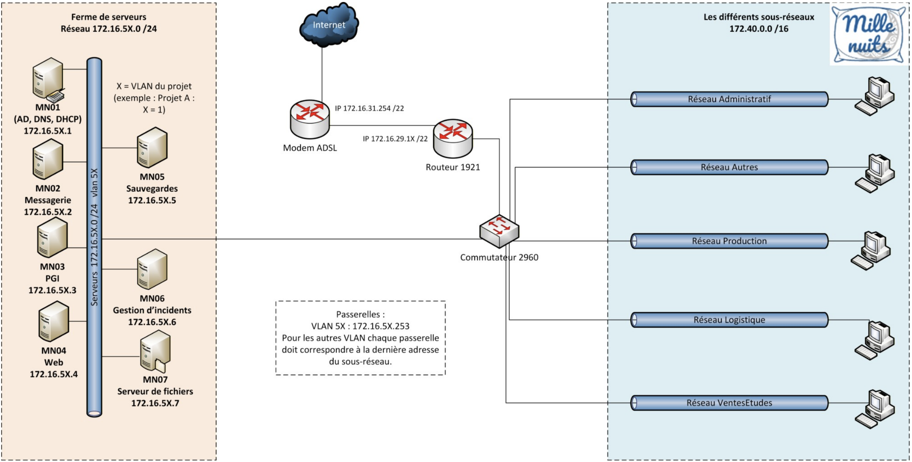

# Mission 2 - Mise en place de l'infrastructure réseau

**Compte rendu rédigé par :** MANCEAU Léandre, RAHMY Arthur, BIDANESSY Coumba  
**Formation :** BTS SIO 1ère année - Option SISR  
**Établissement :** Lycée Paul-Louis Courier, Tours

---

## 1. Schéma physique



---

## 2. Choix des VLANs dans les switchs

Pour chaque VLAN de chaque salle, un ID de VLAN a été attribué, avec l'attribution de chaque port selon le VLAN adapté.

**Exemple — Création du VLAN 20 (Autres) et affectation d'un port :**

```console
Switch>enable
Switch#configure terminal
Enter configuration commands, one per line.  End with CNTL/Z.
Switch(config)#vlan 20
Switch(config-vlan)#name Autres
Switch(config-vlan)#exit
Switch(config)#exit
Switch#
%SYS-5-CONFIG_I: Configured from console by console
```

```console
Switch#configure terminal
Enter configuration commands, one per line.  End with CNTL/Z.
Switch(config)#interface FastEthernet0/1
Switch(config-if)#switchport access vlan 20
Switch(config-if)#exit
Switch(config)#exit
Switch#
%SYS-5-CONFIG_I: Configured from console by console
```

---

## 3. Liaisons trunk entre le commutateur central des salles et le routeur

### Activation du mode trunk sur le commutateur

```console
Switch>enable
Switch#configure terminal
Enter configuration commands, one per line.  End with CNTL/Z.
Switch(config)#int g0/1
Switch(config-if)#switchport mode trunk
Switch(config-if)#end
Switch#
%SYS-5-CONFIG_I: Configured from console by console
```

### Exemple — Mode trunk vers le sous-réseau en VLAN 50

```console
Router(config)#int g0/0.50
Router(config-subif)#
%LINK-5-CHANGED: Interface GigabitEthernet0/0.50, changed state to up
%LINEPROTO-5-UPDOWN: Line protocol on Interface GigabitEthernet0/0.50, changed state to up

Router(config-subif)#encapsulation dot1q 50
Router(config-subif)#ip addr 172.40.2.62 255.255.255.192
```

---

## 4. Routage statique sur le routeur qui relie le modem ADSL

```console
Router>enable
Router#conf t
Enter configuration commands, one per line.  End with CNTL/Z.
Router(config)#int g0/1
Router(config-if)#ip route 0.0.0.0 0.0.0.0 172.16.29.15
```

---

## 5. Translation d'adresse (NAT) mise en place sur le routeur qui relie le modem ADSL

### Définition des access-lists

```console
access-list 1 permit 172.40.0.0 0.0.0.255
access-list 1 permit 172.40.1.0 0.0.0.127
access-list 1 permit 172.40.1.128 0.0.0.63
access-list 1 permit 172.40.2.0 0.0.0.63
access-list 1 permit 172.40.2.64 0.0.0.63
```

### Configuration des sous-interfaces (router-on-a-stick)

```console
interface GigabitEthernet0/0.10
 encapsulation dot1Q 10
 ip address 172.40.1.254 255.255.255.128
 ip nat inside

interface GigabitEthernet0/0.20
 encapsulation dot1Q 20
 ip address 172.40.1.126 255.255.255.128
 ip nat inside

interface GigabitEthernet0/0.30
 encapsulation dot1Q 30
 ip address 172.40.0.254 255.255.255.0
 ip nat inside

interface GigabitEthernet0/0.40
 encapsulation dot1Q 40
 ip address 172.40.2.126 255.255.255.192
 ip nat inside

interface GigabitEthernet0/0.50
 encapsulation dot1Q 50
 ip address 172.40.2.62 255.255.255.192
 ip nat inside
```

### Activation du NAT overload (PAT)

```console
ip nat inside source list 1 interface g0/1 overload
```

### Route statique vers la passerelle du lycée pour l'accès Internet

```console
ip route 0.0.0.0 0.0.0.0 172.16.31.254
```

---

## 6. Captures d'écran Switch / Routeur

Les différentes manipulations effectuées comprennent la sauvegarde des configurations sur le routeur et le switch, ainsi que des tests de connectivité par ping.

### Test de ping sur Internet depuis le PC Portable

```
C:\Users\etudiant>ping 8.8.8.8

Envoi d'une requête 'Ping' 8.8.8.8 avec 32 octets de données :
Réponse de 8.8.8.8 : octets=32 temps=6 ms TTL=111
Réponse de 8.8.8.8 : octets=32 temps=6 ms TTL=111
Réponse de 8.8.8.8 : octets=32 temps=6 ms TTL=111
Réponse de 8.8.8.8 : octets=32 temps=6 ms TTL=111

Statistiques Ping pour 8.8.8.8:
    Paquets : envoyés = 4, reçus = 4, perdus = 0 (perte 0%),
Durée approximative des boucles en millisecondes :
    Minimum = 6ms, Maximum = 6ms, Moyenne = 6ms

C:\Users\etudiant>ping 1.1.1.1

Envoi d'une requête 'Ping' 1.1.1.1 avec 32 octets de données :
Réponse de 1.1.1.1 : octets=32 temps=15 ms TTL=51
Réponse de 1.1.1.1 : octets=32 temps=15 ms TTL=51
Réponse de 1.1.1.1 : octets=32 temps=22 ms TTL=51
Réponse de 1.1.1.1 : octets=32 temps=17 ms TTL=51

Statistiques Ping pour 1.1.1.1:
    Paquets : envoyés = 4, reçus = 4, perdus = 0 (perte 0%),
Durée approximative des boucles en millisecondes :
    Minimum = 15ms, Maximum = 22ms, Moyenne = 17ms
```

### Sauvegarde de la configuration du Switch (TFTP)

```console
Switch#copy startup-config tftp:
Address or name of remote host []? 172.16.30.137
Destination filename [switch-config]? switchm2
!!
1521 bytes copied in 0.009 secs (169000 bytes/sec)
Switch#
```

### Test de ping sur l'interface extérieure du routeur depuis le PC Portable

```
Statistiques Ping pour 172.40.1.254:
    Paquets : envoyés = 4, reçus = 4, perdus = 0 (perte 0%)
Durée approximative des boucles en millisecondes :
    Minimum = 0ms, Maximum = 0ms, Moyenne = 0ms

C:\Users\etudiant>ping 172.16.29.16

Envoi d'une requête 'Ping' 172.16.29.16 avec 32 octets de données :
Réponse de 172.16.29.16 : octets=32 temps<1ms TTL=255
Réponse de 172.16.29.16 : octets=32 temps<1ms TTL=255
Réponse de 172.16.29.16 : octets=32 temps<1ms TTL=255
Réponse de 172.16.29.16 : octets=32 temps<1ms TTL=255

Statistiques Ping pour 172.16.29.16:
    Paquets : envoyés = 4, reçus = 4, perdus = 0 (perte 0%)
Durée approximative des boucles en millisecondes :
    Minimum = 0ms, Maximum = 0ms, Moyenne = 0ms
```

### Test de ping depuis le Routeur

```console
Router#ping 172.40.1.254
Type escape sequence to abort.
Sending 5, 100-byte ICMP Echos to 172.40.1.254, timeout is 2 seconds:
!!!!!
Success rate is 100 percent (5/5), round-trip min/avg/max = 1/1/4 ms

Router#ping 172.16.29.16
Type escape sequence to abort.
Sending 5, 100-byte ICMP Echos to 172.16.29.16, timeout is 2 seconds:
!!!!!
Success rate is 100 percent (5/5), round-trip min/avg/max = 1/1/4 ms

Router#ping 1.1.1.1
Type escape sequence to abort.
Sending 5, 100-byte ICMP Echos to 1.1.1.1, timeout is 2 seconds:
!!!!!
Success rate is 100 percent (5/5), round-trip min/avg/max = 4/7/8 ms
Router#
```

### Création du VLAN 10 — Vérification avec `show vlan brief`

```console
Switch#show vlan brief

VLAN Name                             Status    Ports
---- -------------------------------- --------- ----------------------------
1    default                          active    Fa0/2, Fa0/3, Fa0/4, Fa0/5
                                                Fa0/6, Fa0/7, Fa0/8, Fa0/9
                                                Fa0/10, Fa0/11, Fa0/12, Fa0/13
                                                Fa0/14, Fa0/15, Fa0/16, Fa0/17
                                                Fa0/18, Fa0/19, Fa0/20, Fa0/21
                                                Fa0/22, Fa0/23, Gi0/1, Gi0/2
10   vlan10                           active    Fa0/1
69   vlan69                           active
1002 fddi-default                     act/unsup
1003 token-ring-default               act/unsup
1004 fddinet-default                  act/unsup
1005 trnet-default                    act/unsup
```
