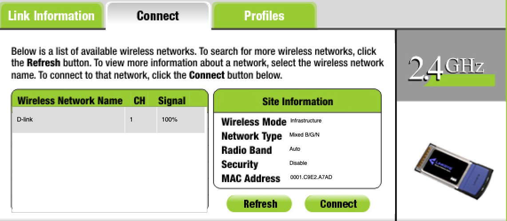
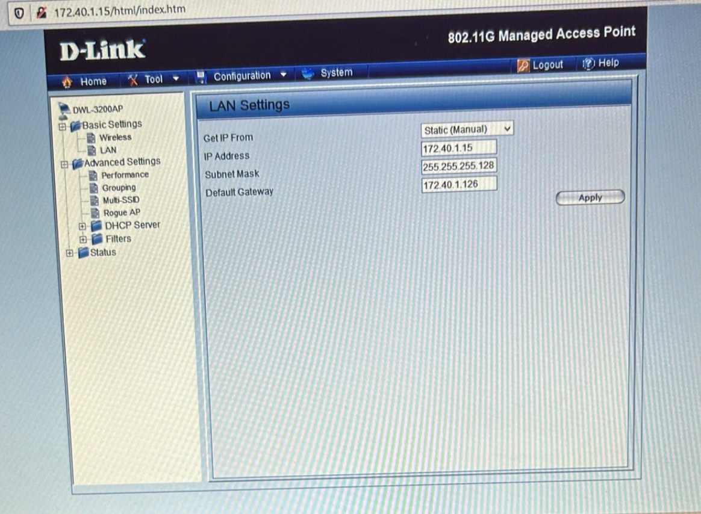

# Mission 3 - Mise en place de l'infrastructure réseau avec VLAN visiteurs et dans le VLAN commerciaux

**Compte rendu rédigé par :** BIDANESSY Coumba, MANCEAU Léandre, RAHMY Arthur  
**Formation :** BTS SIO 1ère année - Option SISR  
**Établissement :** Lycée Paul-Louis Courier, Tours

---

## VLAN Visiteurs

### Calcul VLSM wifi Visiteurs

```
16 * 1,2 = 20 hôtes
2^x - 2 = 20 hôtes
Donc : 2^5 - 2 = 30
Et 32 - 5 = 27 bits
```

- Adresse réseau : `172.40.2.128`
- Adresse de diffusion : `172.40.2.159/27`
- Adresse passerelle : `172.40.2.158`

### Mise en place sur maquette

Voici les étapes clés pour mettre en place la borne wifi visiteurs et d'y accéder à distance :

**1. Mise en place selon l'adressage réseau visiteurs, d'une adresse IP sur l'interface LAN**

Configuration de la borne (Wireless Router) :

| Paramètre    | Valeur          |
|---|---|
| IPv4 Address | 172.40.1.15     |
| Subnet Mask  | 255.255.255.128 |

**2. Ajout de la VLAN 60 (visiteurs) sur le switch et correspondance avec l'interface reliée à la borne WiFi**

```cisco
Switch(config)#vlan 60
Switch(config-vlan)# name Visiteurs
Switch(config-vlan)#
Switch(config-vlan)#end
Switch#configure terminal
Enter configuration commands, one per line.  End with CNTL/Z.
Switch(config)#interface FastEthernet0/7
Switch(config-if)#
%SYS-5-CONFIG_I: Configured from console by console

Switch(config-if)#
Switch(config-if)#switchport access vlan 60
Switch(config-if)#no shutdown
Switch(config-if)#
```

**3. Ajout de la sous-interface de la passerelle visiteurs dans le routeur reliant le modem ADSL**

```cisco
Router(config)#int g0/0.10
Router(config-subif)#encapsulation dot1Q 60

%Configuration of multiple subinterfaces of the same main
interface with the same VID (60) is not permitted.
This VID is already configured on GigabitEthernet0/0.60.

Router(config-subif)#ip addr 172.40.2.158 255.255.255.224
```

**4. Connexion au D-Link avec un PC portable**



### Fiche de tests

Programmes effectuées sur les équipements et tests ont été effectués et réussis.

---

## Wifi dans le VLAN Autres

### Mise en place sur maquette

**1. Modification du LAN avec une adresse IP du réseau Autres**

| Paramètre    | Valeur          |
|---|---|
| IPv4 Address | 172.40.1.15     |
| Subnet Mask  | 255.255.255.128 |

**2. Correspondance de la VLAN 20 (VLAN Autres) sur l'interface du switch reliée à la borne WiFi**

```cisco
Switch>enable
Switch#
Switch#configure terminal
Enter configuration commands, one per line.  End with CNTL/Z.
Switch(config)#interface FastEthernet0/7
Switch(config-if)#
Switch(config-if)#
Switch(config-if)#switchport access vlan 20
Switch(config-if)#
```

### Fiche de tests

**1. Configuration sur le D-Link (interface web)**



| Paramètre       | Valeur          |
|---|---|
| Get IP From     | Static (Manual) |
| IP Address      | 172.40.1.15     |
| Subnet Mask     | 255.255.255.128 |
| Default Gateway | 172.40.1.126    |

**2. Ping depuis un PC portable connecté au WiFi, vers le WiFi et un équipement du réseau Autres**

```
Statistiques Ping pour 172.40.1.15:
    Paquets : envoyés = 4, reçus = 4, perdus = 0 (perte 0%)
Durée approximative des boucles en millisecondes :
    Minimum = 3ms, Maximum = 15ms, Moyenne = 9ms

C:\Users\etudiant>ping 172.40.1.2

Envoi d'une requête 'Ping' 172.40.1.2 avec 32 octets de données :
Réponse de 172.40.1.2 : octets=32 temps<1ms TTL=128
Réponse de 172.40.1.2 : octets=32 temps<1ms TTL=128
Réponse de 172.40.1.2 : octets=32 temps<1ms TTL=128
Réponse de 172.40.1.2 : octets=32 temps<1ms TTL=128

Statistiques Ping pour 172.40.1.2:
    Paquets : envoyés = 4, reçus = 4, perdus = 0 (perte 0%)
Durée approximative des boucles en millisecondes :
    Minimum = 0ms, Maximum = 0ms, Moyenne = 0ms
```
