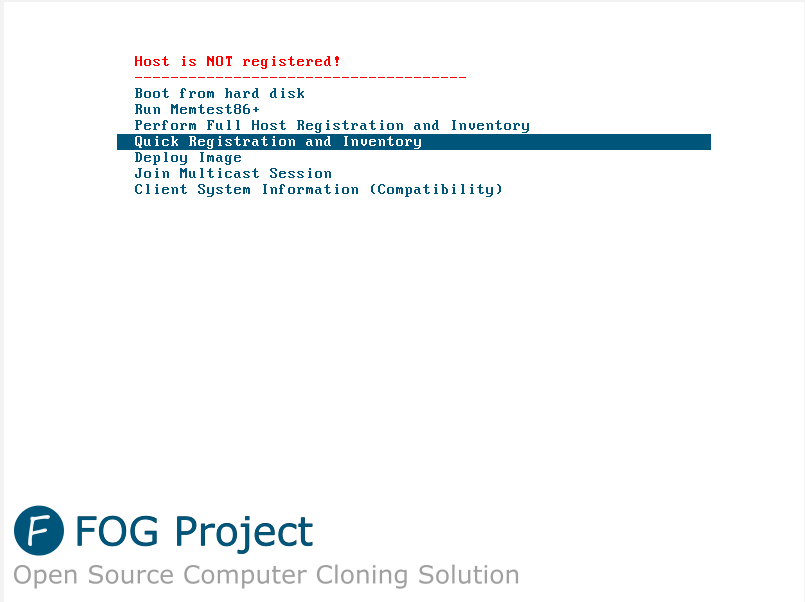
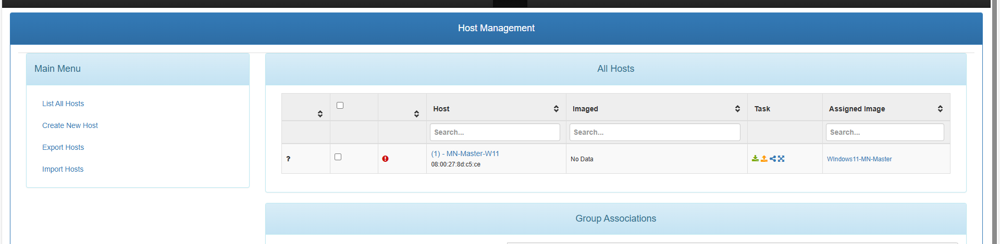
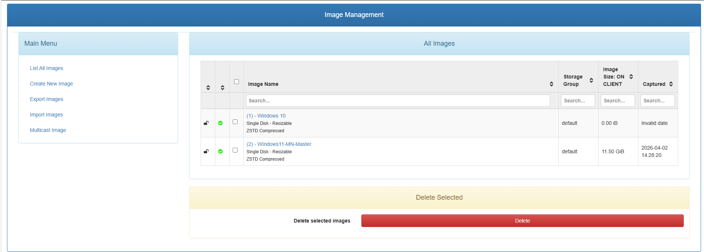
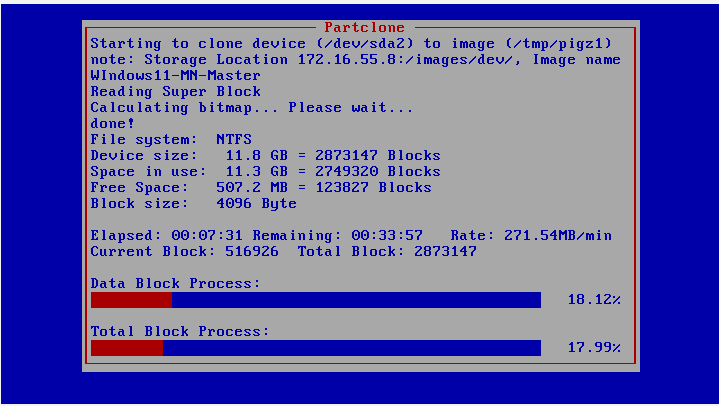

# Mission 3 - Mise en place d'un outil de déploiement des postes (FOG Project)

> 👤 **Fiche rédigée par** : GADONNAUD Ewen  
> 🎓 **Formation** : BTS SIO 1ère année - Option SISR  
> 🏫 **Établissement** : Lycée Paul-Louis Courier, Tours  
> 📅 **Date** : Avril 2026

Ce guide couvre l'installation et la configuration de FOG Project sur le serveur MN08, ainsi que la préparation du poste maître Windows 11 et son déploiement sur les postes clients de l'entreprise Mille Nuits.

---

## Prérequis

- Serveur MN08 sous Debian 12 avec accès internet, IP fixe `172.16.55.8`
- Poste maître Windows 11 virtualisé sous VirtualBox
- Connexion ethernet entre le PC hébergeant la VM et MN08

---

## 1. Préparation du poste maître Windows 11

### 1.1 Installation de Windows 11

Une VM Windows 11 est créée sous VirtualBox sur un poste du labo. Elle servira de **master** : une fois capturée par FOG, son image sera déployée sur les 19 postes restants.

Configuration de la VM :

- OS : Windows 11
- RAM : 4 Go minimum
- Disque : 60 Go
- Réseau : **Accès par pont (Bridge)** sur la carte ethernet physique du poste hôte

### 1.2 Installation des logiciels via Ninite

Afin d'installer rapidement l'ensemble des logiciels requis par le cahier des charges, l'outil **Ninite** a été utilisé. Ninite permet de sélectionner plusieurs applications et de générer un installeur unique qui les installe toutes automatiquement, sans interaction.

Les applications suivantes ont été sélectionnées sur [https://ninite.com](https://ninite.com/) :

|Application|Rôle|
|---|---|
|Firefox|Navigateur web|
|LibreOffice|Suite bureautique|
|VLC|Lecteur multimédia|
|Foxit Reader|Lecteur PDF|

L'installeur Ninite généré a été exécuté sur la VM — toutes les applications ont été installées en une seule opération.

### 1.3 Création de l'utilisateur local

Un utilisateur local a été créé conformément au cahier des charges :

- **Nom d'utilisateur** : `Administrateur`
- **Mot de passe** : `Mille_2026`
- **Type** : Administrateur local

### 1.4 Sysprep du poste maître

Avant la capture par FOG, le poste maître doit être **généralisé** avec Sysprep afin de supprimer les informations propres à la machine (SID, nom d'hôte, etc.) pour permettre son déploiement sur d'autres matériels.

Lancer Sysprep depuis le poste maître :

```
C:\Windows\System32\Sysprep\sysprep.exe
```

Paramètres à appliquer :

- Action de nettoyage du système : **Entrer en mode OOBE (Out-of-Box Experience)**
- Cocher **Généraliser**
- Options d'arrêt : **Arrêter**

> ⚠️ Après le Sysprep, ne pas redémarrer Windows normalement. La VM doit booter directement en **PXE** pour la capture FOG, sous peine de rendre l'installation inutilisable.

---

## 2. Installation de FOG sur MN08

### 2.1 Configuration réseau de MN08

Avant l'installation, MN08 doit disposer d'une **IP statique**. Celle-ci a été configurée à `172.16.55.8/24`.

Vérification :

```bash
ip a
```

### 2.2 Clonage du dépôt FOG

La méthode d'installation recommandée est via Git :

```bash
sudo apt install git -y
cd /root
git clone https://github.com/FOGProject/fogproject.git
cd fogproject/bin
```

> La version installée est FOG Project **v1.5.10.1812** (dernière version stable, mars 2026).

### 2.3 Lancement de l'installeur

```bash
sudo ./installfog.sh
```

L'installeur pose plusieurs questions. Voici les réponses appliquées dans le contexte Mille Nuits :

|Question|Réponse|Justification|
|---|---|---|
|Type d'installation|**N** (Normal Server)|Serveur FOG complet|
|Adresse IP du serveur|**172.16.55.8**|IP fixe de MN08|
|Utiliser le DHCP de FOG ?|**Y**|Environnement isolé, pas de DHCP externe joignable depuis le poste de labo|
|Adresse du routeur DHCP|**172.16.55.252**|Passerelle du réseau Mille Nuits|
|Pack de langue|**N**|Laisser par défaut|
|Utiliser HTTPS ?|**N**|Réseau interne de labo|
|Changer le hostname ?|**N**|Conserver `mn08.MN55.lan`|

> ⚠️ L'installeur s'arrête en cours de route si le compte système `fogproject` existe déjà d'une installation précédente. Dans ce cas, supprimer le compte avant de relancer :
> 
> ```bash
> userdel fogproject
> ./installfog.sh
> ```

### 2.4 Initialisation de la base de données

Une fois les paquets installés, l'installeur demande d'initialiser le schéma de base de données depuis l'interface web. Depuis un navigateur sur le réseau :

```
http://172.16.55.8/fog/management
```

Cliquer sur **Install/Upgrade Now** → attendre le message **"Update/Install Successful"** → retourner sur le terminal et appuyer sur **Entrée** pour terminer l'installation.

> ⚠️ Ne pas fermer le terminal avant cette dernière étape — c'est à ce moment que FOG configure les fichiers de démarrage PXE et le répertoire `/tftpboot`.

### 2.5 Vérification des services

Une fois l'installation terminée, vérifier que les services essentiels sont bien actifs :

```bash
systemctl status isc-dhcp-server
systemctl status tftpd-hpa
systemctl status apache2
```

Les identifiants par défaut de l'interface web sont :

- **Utilisateur** : `fog`
- **Mot de passe** : `password`

> Changer le mot de passe immédiatement après la première connexion.

---

## 3. Configuration du boot PXE côté client

### 3.1 Connexion physique

Le poste hébergeant la VM master est connecté **directement en ethernet** à MN08. La VM est configurée en mode **bridge** sur la carte ethernet physique du poste hôte, ce qui lui permet d'obtenir une IP directement depuis le DHCP de FOG (`172.16.55.10 - 172.16.55.254`).

### 3.2 Configuration VirtualBox

Dans les paramètres réseau de la VM sous VirtualBox :

- **Mode d'accès réseau** : Accès par pont (Bridge)
- **Nom** : carte ethernet physique du poste hôte
- **Type de carte** : Intel PRO/1000 MT Desktop (82540EM) — meilleure compatibilité iPXE

### 3.3 Ordre de boot

Dans les paramètres de la VM → **Système** → modifier l'ordre de démarrage pour mettre **Réseau** en premier, ou utiliser **F12** au démarrage pour sélectionner le boot PXE manuellement.



---

## 4. Capture de l'image du poste maître

### 4.1 Enregistrement du master dans FOG

Démarrer la VM master en PXE. Au menu FOG, sélectionner **Quick Registration and Inventory**. La machine est alors enregistrée dans FOG avec son adresse MAC.

Dans l'interface web → **Gestion des hôtes** → renommer le poste en `MN-Master-W11`.


### 4.2 Créer le conteneur image

Dans l'interface web → **Gestion des images** → **Ajouter une image** :

|Champ|Valeur|
|---|---|
|Nom|`Windows11-MN-Master`|
|Type d'OS|Windows 11|
|Type d'image|Single disk - Resizable|

Associer cette image au poste `MN-Master-W11` dans sa fiche hôte.


### 4.3 Lancer la tâche de capture

Dans **Gestion des hôtes** → `MN-Master-W11` → **Tâches de base** → **Capturer**.

Redémarrer la VM en PXE. FOG lance automatiquement **Partclone** qui compresse et transfère l'image sur le serveur. Une fois la capture terminée, la VM redémarre.



---

## 5. Déploiement sur les postes clients

### 5.1 Enregistrement des postes cibles

Pour chaque poste cible, booter en PXE → **Quick Registration** → le poste apparaît dans **Gestion des hôtes**.

Assigner l'image `Windows11-MN-Master` à chaque hôte depuis sa fiche.

### 5.2 Lancer le déploiement

Dans **Gestion des hôtes** → sélectionner le poste → **Tâches de base** → **Déployer**.

Redémarrer le poste en PXE — FOG déploie automatiquement l'image.

> Pour déployer sur plusieurs machines simultanément, utiliser le mode **Multicast** : **Tâches** → **Avancé** → **Multicast**. Ce mode est recommandé au-delà de 2-3 machines car chaque paquet n'est émis qu'une seule fois sur le réseau, ce qui réduit considérablement la charge sur le serveur.

---

## Récapitulatif

|Étape|Action|Résultat|
|---|---|---|
|Préparation master|Installation W11 + logiciels via Ninite + Sysprep|Poste maître prêt|
|Installation FOG|Clone Git + `installfog.sh` + init BDD|Serveur FOG opérationnel sur MN08|
|Boot PXE|VM bridgée sur ethernet → MN08|IP obtenue depuis DHCP FOG|
|Capture|Tâche Capture → Partclone|Image stockée sur MN08|
|Déploiement|Tâche Deploy (unicast ou multicast)|19 postes déployés|
